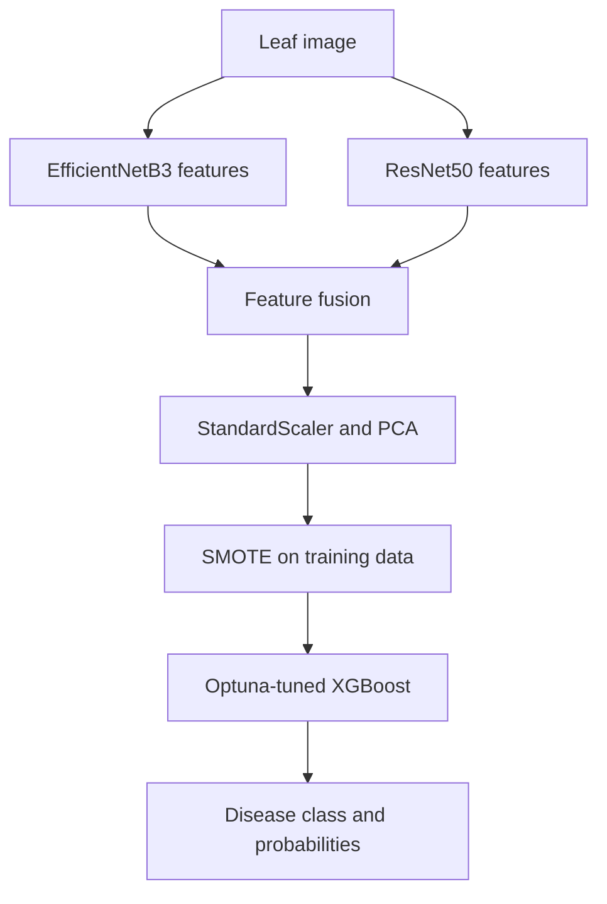

# SmartLeafNet

Hybrid deep-learning and machine-learning pipeline for three-class rice leaf disease classification.

SmartLeafNet combines complementary visual representations from **EfficientNetB3** and **ResNet50** with **PCA**, **SMOTE**, an **Optuna-tuned XGBoost** classifier, and evaluation on a held-out validation directory. The project targets three classes: **Brownspot**, **Healthy**, and **Hispa**.

## Why this project matters

Visual crop inspection is slow, subjective, and difficult to scale. SmartLeafNet explores a practical alternative: use pretrained CNNs for image representation, then train a compact tree-based classifier on the fused features. This design separates expensive feature extraction from the downstream classifier and makes model comparisons easier.

## Pipeline



The cleaned implementation keeps the external validation set isolated: scaling and PCA are fitted on training features only, and SMOTE is applied only to training partitions.

## Dataset snapshot

The supplied experimental notebook records:

| Split | Images |
|---|---:|
| Training | 17,216 |
| Validation | 5,554 |
| Total | 22,770 |

The images are not redistributed in this repository. Place a properly licensed copy of the dataset in the folder structure shown below.

```text
data/
├── train/
│   ├── Brownspot/
│   ├── Healthy/
│   └── Hispa/
└── valid/
    ├── Brownspot/
    ├── Healthy/
    └── Hispa/
```

## Reported results

| Metric | Reported value | Evidence |
|---|---:|---|
| Overall accuracy | 98% | Project report |
| Macro F1-score | 0.95 | Project report |
| Minority-class recall improvement after SMOTE | 12% | Project report |

These are the final metrics reported by the project team. The supplied notebook is an exploratory artifact containing multiple model trials; its stored outputs did not provide a single clean reproduction of the report's final holdout result. For that reason, this repository labels the figures as **reported** rather than independently reproduced. Run the cleaned pipeline to generate a fresh `metrics.json` for your dataset and environment.

## Repository structure

```text
SmartLeafNet/
├── src/
│   └── train.py                    # Clean, leakage-aware training pipeline
├── notebooks/
│   └── SmartLeafNet_experiments.ipynb
├── docs/
│   ├── SmartLeafNet_Report.pdf
│   └── SmartLeafNet_Presentation.pdf
├── data/
│   └── README.md
├── requirements.txt
└── README.md
```

## Quick start

Python 3.10 or 3.11 is recommended. A CUDA-capable GPU is strongly recommended for feature extraction.

```bash
python -m venv .venv
source .venv/bin/activate  # Windows: .venv\Scripts\activate
pip install -r requirements.txt
```

Add the dataset under `data/train` and `data/valid`, then run:

```bash
python src/train.py \
  --train-dir data/train \
  --valid-dir data/valid \
  --output-dir artifacts \
  --trials 20
```

The script writes the fitted scaler, PCA transformer, XGBoost model, class mapping, and evaluation metrics to `artifacts/`.

## Technical decisions

- **EfficientNetB3 + ResNet50:** complementary ImageNet-pretrained visual features.
- **StandardScaler + PCA:** normalized, lower-dimensional fused representations.
- **SMOTE:** minority-class balancing applied only to training data.
- **Optuna:** macro-F1 optimization on a real, non-synthetic tuning partition.
- **XGBoost:** efficient multiclass classification with class probabilities.

## Limitations and next steps

- Results depend on image provenance, class balance, augmentation, and split strategy.
- The current task covers three classes and should not be treated as an agronomic diagnosis tool.
- Future work should add field-condition data, repeated cross-validation, calibration analysis, explainability, and an inference API.

## Project documents

- [Full project report](docs/SmartLeafNet_Report.pdf)
- [Presentation deck](docs/SmartLeafNet_Presentation.pdf)
- [Exploratory notebook](notebooks/SmartLeafNet_experiments.ipynb)

## Contributors

Academic team project by Ajmal Abbas, Aswin Sankar, Pratheswaran Hariharan, and Rohit Kumar.

Maintained by **Pratheswaran Hariharan** — [Portfolio](https://pratheswaran.com) · [LinkedIn](https://www.linkedin.com/in/pratheswaran-hariharan-a78382214/)

